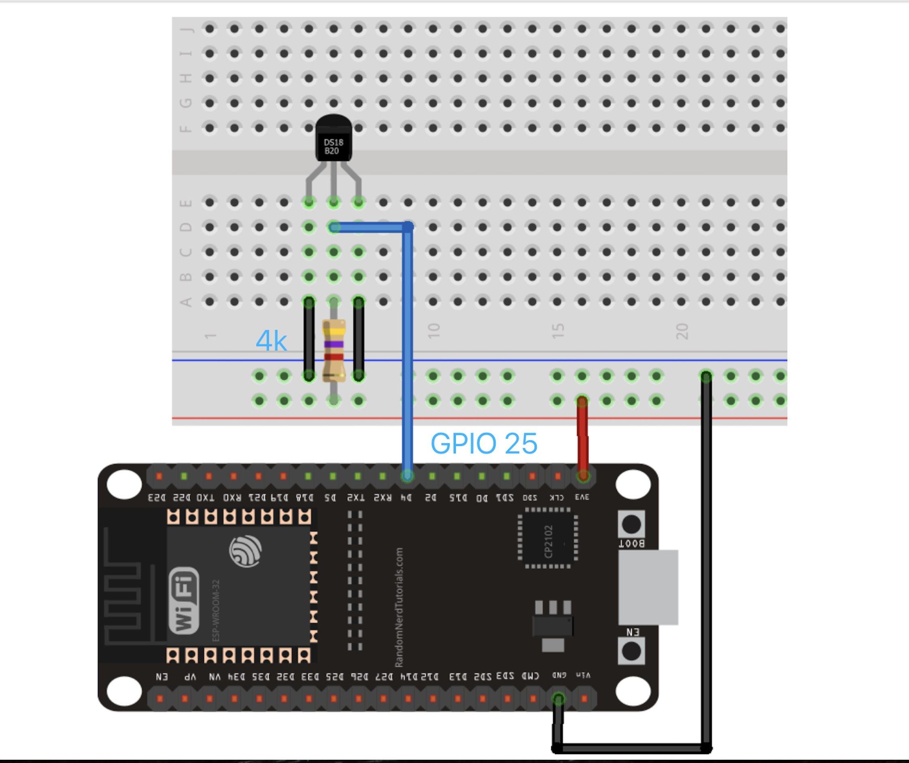

# ESP32 温度监控及 Web 应用项目

该项目包括两个主要部分：使用 MQTT 发送温度数据的 ESP32 设备和一个用于显示这些数据的基于 Flask 的 Web 应用程序。


## 第 1 部分：ESP32 温度监控

### 系统要求

- ESP32 开发板
- DS18B20 温度传感器
- 支持 ESP32 的 Arduino IDE
- Wi-Fi 连接

### 配置和设置

1. **安装 Arduino IDE**：
   从 [Arduino 网站](https://www.arduino.cc/en/software) 下载并安装。

2. **在 Arduino IDE 中添加 ESP32 支持**：
   按照[这里](https://randomnerdtutorials.com/installing-the-esp32-board-in-arduino-ide-windows-instructions/)的说明操作。

3. **安装所需的库**：
   在 Arduino IDE 中，转到 `Sketch` > `Include Library` > `Manage Libraries...` 并安装：
    - `WiFi`
    - `PubSubClient`
    - `ArduinoJson`
    - `OneWire`
    - `DallasTemperature`

4. **配置 Wi-Fi 和 MQTT 设置**：
   在 Arduino IDE 中用您的 Wi-Fi 和 MQTT 详细信息修改提供的 ESP32 代码。

5. **将 DS18B20 传感器连接到 ESP32**：
    - DS18B20 VCC 接 ESP32 3.3V
    
    - DS18B20 GND 接 ESP32 GND
    
    - DS18B20 数据接 ESP32 GPIO 25
    
      
    

6. **上传代码**：
   将 ESP32 连接到计算机，在 Arduino IDE 中选择正确的板和端口，然后上传。

## 第 2 部分：Flask Web 应用程序

### 系统要求

- Python 3.8 或更高版本
- 虚拟环境工具（如 `virtualenv`）

### 本地设置

1. **克隆仓库**：
   ```
   git clone [仓库 URL]
   cd [仓库名称]
   ```

2. **创建虚拟环境**：
   ```
   python -m venv venv
   source venv/bin/activate  # Windows: venv\Scripts\activate
   ```

3. **安装依赖**：
   ```
   pip install -r requirements.txt
   ```

4. **在 `app.py` 中配置 MQTT 设置**：
   修改 `app.py` 中的 MQTT 配置。

5. **运行应用程序**：
   ```
   python app.py
   ```
   在 `http://localhost:8080` 访问。

### 部署到 Fly.io

1. **安装 Fly.io CLI**：
   按照 [Fly.io 文档](https://fly.io/docs/getting-started/installing-flyctl/) 中的说明进行操作。

2. **登录 Fly.io**：
   
   ```
   flyctl auth login
   ```
   
3. **初始化 Fly.io 应用**：
   ```
   flyctl launch
   ```

4. **部署应用程序**：
   ```
   flyctl deploy
   ```

5. **验证部署**：
   ```
   flyctl status
   ```
