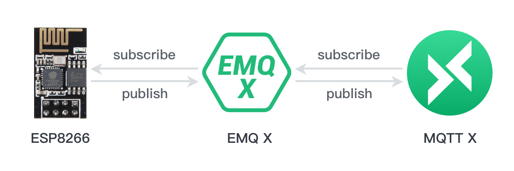

# ESP8266 连接到公共 MQTT Broker

MQTT 是轻量级的、灵活的物联网消息交换和数据传递协议，致力于为 IoT 开发人员实现灵活性与硬件/网络资源的平衡。在这个项目中我们将实现 **ESP8266 与 EMQ X 公共 MQTT Broker 连接**，并使用 Arduino IDE 来对 ESP8266 进行编程。

ESP8266 提供了⼀套⾼度集成的 Wi-Fi SoC 解决⽅案，其低功耗、 紧凑设计和⾼稳定性可以满⾜⽤户的需求。 ESP8266 拥有完整的且⾃成体系的 Wi-Fi ⽹络功能，既能够独⽴应⽤，也可以作为从机搭载于其他主机 MCU 运⾏。

在这个项目中我们将使用由  **[EMQ X Cloud](<http://cloud.emqx.io/>) **运营和维护的**公共 MQTT Broker**， EMQ X Cloud 是 EMQ X 推出物联网平台公有云服务，EMQ X Cloud 提供一站式运维代管、独有隔离环境的 EMQ X 接入平台服务。


### 所需组件

* ESP8266
* Arduino IDE
* [MQTTX](<https://mqttx.app/>):  优雅的跨平台 MQTT 5.0 客户端工具
* 免费的公共 [MQTT 服务器
  - Broker: **broker.emqx.io**
  - TCP Port: **1883**
  - Websocket Port: **8083**


### 项目图




### 代码编写

1. 首先我们将导入 **ESP8266WiFi** 和 **PubSubClient** 库，ESP8266WiFi  库能够将ESP8266连接到WiFi网络，PubSubClient  库，使我们能够连接到MQTT代理并发布/订阅主题消息。

   ```c
   #include <ESP8266WiFi.h>
   #include <PubSubClient.h>
   ```

2. 设置 WIFI 名称和密码，以及 MQTT Broker 连接地址和端口

   ```c
   const char *ssid = "name"; // Enter your WiFi name
   const char *password = "pass";  // Enter WiFi password
   const char *mqtt_broker = "broker.emqx.io";
   const int mqtt_port = 1883;
   ```

3.  我们打开了一个串行连接，以便于输出程序的结果并且连接到WiFi网络

   ```c
   // Set software serial baud to 115200;
   Serial.begin(115200);
   // connecting to a WiFi network
   WiFi.begin(ssid, password);
   while (WiFi.status() != WL_CONNECTED) {
       delay(500);
       Serial.println("Connecting to WiFi..");
   }
   ```

4. 我们将设置 MQTT Broker，并编写回调函数，同时将连接信息打印到串口监视器上

   ```c
   client.setServer(mqtt_broker, mqtt_port);
   client.setCallback(callback);
   while (!client.connected()) {
       Serial.println("Connecting to public emqx mqtt broker.....");
       if (client.connect("esp8266-client")) {
           Serial.println("Public emqx mqtt broker connected");
       } else {
           Serial.print("failed with state ");
           Serial.print(client.state());
           delay(2000);
       }
   }
   
   void callback(char *topic, byte *payload, unsigned int length) {
       Serial.print("Message arrived in topic: ");
       Serial.println(topic);
       Serial.print("Message:");
       for (int i = 0; i < length; i++) {
           Serial.print((char) payload[i]);
       }
       Serial.println();
       Serial.println("-----------------------");
   }
   ```

5. MQTT Broker 连接成功后，ESP8266 将向 MQTT Broker 发布和订阅消息

   ```c
   // publish and subscribe
   client.publish("esp8266/test", "hello emqx");
   client.subscribe("esp8266/test");
   ```

6. 我们将首先将主题名称打印到串行端口，然后打印收到的消息的每个字节

   ```c
   void callback(char *topic, byte *payload, unsigned int length) {
       Serial.print("Message arrived in topic: ");
       Serial.println(topic);
       Serial.print("Message:");
       for (int i = 0; i < length; i++) {
           Serial.print((char) payload[i]);
       }
       Serial.println();
       Serial.println("-----------------------");
   }
   ```


### 连接和测试

1. [请使用 Arduino IDE ](<https://www.arduino.cc/en/Main/Software>)将完整代码上传 ESP8266，并打开串口监视器

   

2. 建立 MQTTX 客户端 与 MQTT Broker 连接, 并向 ESP8266 发送消息

   

3. 在串口监视器查看 ESP8266 接收到的消息

   


### Arduino IDE 完整代码

```c
#include <ESP8266WiFi.h>
#include <PubSubClient.h>

const char *ssid = "name"; // Enter your WiFi name
const char *password = "pass";  // Enter WiFi password
const char *mqtt_broker = "broker.emqx.io";
const int mqtt_port = 1883;

WiFiClient espClient;
PubSubClient client(espClient);

void setup() {
    // Set software serial baud to 115200;
    Serial.begin(115200);
    // connecting to a WiFi network
    WiFi.begin(ssid, password);
    while (WiFi.status() != WL_CONNECTED) {
        delay(500);
        Serial.println("Connecting to WiFi..");
    }
    Serial.println("Connected to the WiFi network");
    //connecting to a mqtt broker
    client.setServer(mqtt_broker, mqtt_port);
    client.setCallback(callback);
    while (!client.connected()) {
        Serial.println("Connecting to public emqx mqtt broker.....");
        if (client.connect("esp8266-client")) {
            Serial.println("Public emqx mqtt broker connected");
        } else {
            Serial.print("failed with state ");
            Serial.print(client.state());
            delay(2000);
        }
    }
    // publish and subscribe
    client.publish("esp8266/test", "hello emqx");
    client.subscribe("esp8266/test");
}

void callback(char *topic, byte *payload, unsigned int length) {
    Serial.print("Message arrived in topic: ");
    Serial.println(topic);
    Serial.print("Message:");
    for (int i = 0; i < length; i++) {
        Serial.print((char) payload[i]);
    }
    Serial.println();
    Serial.println("-----------------------");
}

void loop() {
    client.loop();
}
```


### 结论与建议

至此，我们已成功 ESP8266 连接到公共 MQTT Broker。 在本项目中我们只是简单的将 ESP8266 连接到公共MQTT Broker，当然 ESP8266 还能与各类传感器相连，并将传感器数据上报到 MQTT Broker。请关注我们，我们将带来更多关于 ESP8266 相关文章。