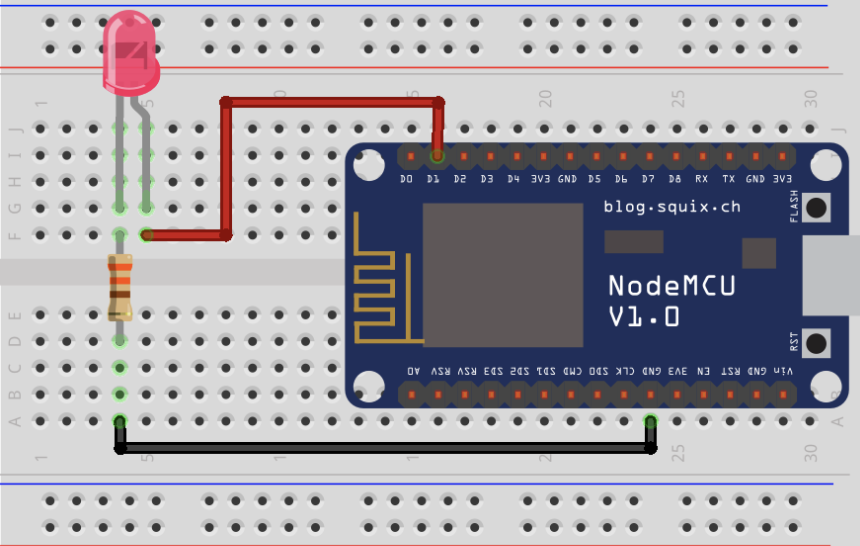
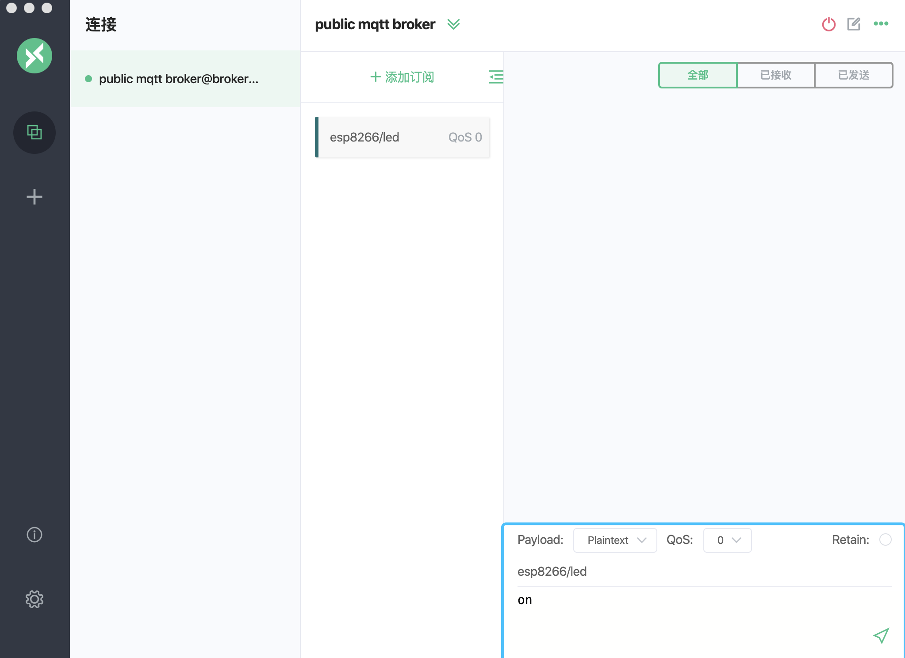

# NodeMCU ESP8266 与免费公共 MQTT 服务器实现远程控制 LED 灯

[MQTT](https://zh.wikipedia.org/zh-hans/MQTT) 是轻量级的、灵活的物联网消息交换和数据传递协议，致力于为 IoT 开发人员实现灵活性与硬件/网络资源的平衡。

[NodeMCU](https://www.nodemcu.com/) 是一个开源的物联网平台。它使用Lua手稿语言编程。该平台基于eLua开源项目，底层使用ESP8266 sdk 0.9.5版本。

在此项目中我们将实现 NodeMCU ESP8266 与 [EMQ X Cloud](https://cloud.emqx.io/cn/) 运营和维护的免费公共 MQTT 服务器远程控制 LED 灯，并使用 Arduino IDE 来对 NodeMCU ESP8266 进行编程。 EMQ X Cloud 是由 EMQ 推出的安全的 [MQTT 物联网云服务平台](https://cloud.emqx.io/cn/)，它提供一站式运维代管、独有隔离环境的 **MQTT 5.0** 接入服务。


### 所需组件

* NodeMCU
* Arduino IDE
* LED * 1，330 Ω 电阻
* [MQTTX](<https://mqttx.app/>):  优雅的跨平台 MQTT 5.0 客户端工具
* 免费的公共 [MQTT 服务器
  - Broker: **broker.emqx.io**
  - TCP Port: **1883**
  - Websocket Port: **8083**


### NodeMCU ESP8266 和 LED 连接图




### 代码编写

1. 首先我们将导入 **ESP8266WiFi** 和 **PubSubClient** 库，ESP8266WiFi  库能够将ESP8266连接到WiFi网络，PubSubClient  库，使我们能够连接到MQTT代理并发布/订阅主题消息。

   ```c
   #include <ESP8266WiFi.h>
   #include <PubSubClient.h>
   ```

2. 我们将使用 NodeMCU ESP8266 的 **D1** 引脚来连接到 LED，实际上该引脚内部连接到 ESP8266 模块的 **GPIO5**。

   ```c
   // GPIO 5 D1
   #define LED 5
   ```

3. 设置 WIFI 名称和密码，以及 MQTT Broker 连接地址和端口

   ```c
   const char *ssid = "name"; // Enter your WiFi name
   const char *password = "pass";  // Enter WiFi password
   const char *mqtt_broker = "broker.emqx.io";
   const int mqtt_port = 1883;
   ```

4. 我们打开了一个串行连接，以便于输出程序的结果并且连接到WiFi网络

   ```c
   // Set software serial baud to 115200;
   Serial.begin(115200);
   // connecting to a WiFi network
   WiFi.begin(ssid, password);
   while (WiFi.status() != WL_CONNECTED) {
       delay(500);
       Serial.println("Connecting to WiFi..");
   }
   ```

5. 我们将设置 MQTT Broker，同时将连接信息打印到串口监视器上

   ```c
   client.setServer(mqtt_broker, mqtt_port);
   client.setCallback(callback);
   while (!client.connected()) {
       Serial.println("Connecting to public emqx mqtt broker.....");
       if (client.connect("esp8266-client")) {
           Serial.println("Public emqx mqtt broker connected");
       } else {
           Serial.print("failed with state ");
           Serial.print(client.state());
           delay(2000);
       }
   }
   ```

6. MQTT Broker 连接成功后，ESP8266 将向 MQTT Broker 发布和订阅消息

   ```c
   // publish and subscribe
   client.publish("esp8266/test", "hello emqx");
   client.subscribe("esp8266/test");
   ```

7. 编写回调函数，从串行监视器读取下发指令并且控制 LED 的开和关

   ```c
   void callback(char *topic, byte *payload, unsigned int length) {
       Serial.print("Message arrived in topic: ");
       Serial.println(topic);
       Serial.print("Message:");
       String message;
       for (int i = 0; i < length; i++) {
           message = message + (char) payload[i];  // convert *byte to string
       }
       Serial.print(message);
       if (message == "on") { digitalWrite(LED, LOW); }   // LED on
       if (message == "off") { digitalWrite(LED, HIGH); } // LED off
       Serial.println();
       Serial.println("-----------------------");
   }
   ```

### 连接和测试

1. [请使用 Arduino IDE ](<https://www.arduino.cc/en/Main/Software>)将完整代码上传 ESP8266，并打开串口监视器

   

2. 建立 MQTTX 客户端 与 MQTT Broker 连接, 并向 ESP8266 发送指令

   


### Arduino IDE 完整代码

```c
#include <ESP8266WiFi.h>
#include <PubSubClient.h>

// GPIO 5 D1
#define LED 5

const char *ssid = "name"; // Enter your WiFi name
const char *password = "pass";  // Enter WiFi password
const char *mqtt_broker = "broker.emqx.io";
const int mqtt_port = 1883;

WiFiClient espClient;
PubSubClient client(espClient);

void setup() {
    // Set software serial baud to 115200;
    Serial.begin(115200);
    // connecting to a WiFi network
    WiFi.begin(ssid, password);
    while (WiFi.status() != WL_CONNECTED) {
        delay(500);
        Serial.println("Connecting to WiFi..");
    }
    Serial.println("Connected to the WiFi network");
    //connecting to a mqtt broker
    client.setServer(mqtt_broker, mqtt_port);
    client.setCallback(callback);
    while (!client.connected()) {
        Serial.println("Connecting to public emqx mqtt broker.....");
        if (client.connect("esp8266-client")) {
            Serial.println("Public emqx mqtt broker connected");
        } else {
            Serial.print("failed with state ");
            Serial.print(client.state());
            delay(2000);
        }
    }
    // publish and subscribe
    client.publish("esp8266/led", "hello emqx");
    client.subscribe("esp8266/led");
}

void callback(char *topic, byte *payload, unsigned int length) {
    Serial.print("Message arrived in topic: ");
    Serial.println(topic);
    Serial.print("Message:");
    String message;
    for (int i = 0; i < length; i++) {
        message = message + (char) payload[i];  // convert *byte to string
    }
    Serial.print(message);
    if (message == "on") { digitalWrite(LED, LOW); }   // LED on
    if (message == "off") { digitalWrite(LED, HIGH); } // LED off
    Serial.println();
    Serial.println("-----------------------");
}

void loop() {
    client.loop();
}
```


### 总结

至此，我们成功实现 NodeMCU ESP8266 与免费公共 MQTT 服务器远程控制 LED 灯，该例子只是描述了一个简单的场景，在实际的项目中，需要更加安全的连接方式，以及对物联网数据进行持久化等功能。

接下来我们将会陆续发布更多关于物联网开发及 ESP8266 的相关文章，尽情关注。