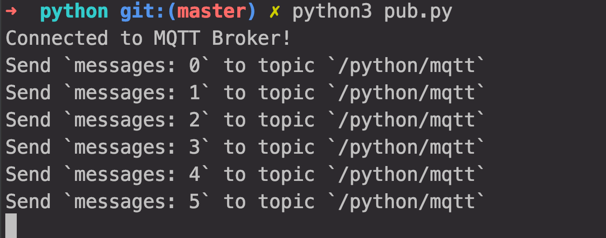
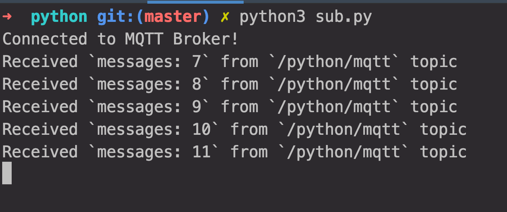

# 如何在 Python 中使用 MQTT

Python 作为一门快速发展的语言，已经成为系统集成领域的优选语言之一，其可覆盖从电路逻辑设计到大数据分析的物联网端到端开发。各领域开发者可以利用 Python 交叉涉足物联网设备、边缘计算、云计算、数据分析的工程设计。

[MQTT](https://www.emqx.io/cn/mqtt) 是一种基于发布/订阅模式的 **轻量级物联网消息传输协议** ，可在严重受限的硬件设备和低带宽、高延迟的网络上实现稳定传输。它凭借简单易实现、支持 QoS、报文小等特点，占据了物联网协议的半壁江山。

本文主要介绍如何在 Python 项目中使用 **Paho MQTT**  客户端库 ，实现客户端与 MQTT 服务器的连接、订阅、取消订阅、收发消息等功能。


## 项目初始化

#### 获取公共 MQTT Broker

在本文中我们将使用由  **[EMQ X Cloud](<http://cloud.emqx.io/>) **运营和维护的[公共 MQTT Broker](<https://www.emqx.io/mqtt/public-mqtt5-broker>)， EMQ X Cloud 是 EMQ X 推出物联网平台公有云服务，EMQ X Cloud 提供一站式运维代管、独有隔离环境的 EMQ X 接入平台服务。公共 MQTT Broker 接入信息如下：

- Broker: **broker.emqx.io**
- TCP Port: **1883**
- Websocket Port: **8083**

#### 选择 MQTT 客户端库

Paho Python客户端在 Python 2.7 或 3.x 上为客户端类提供了对MQTT v3.1和v3.1.1的支持。它还提供了一些帮助程序功能，使将一次性消息发布到MQTT服务器变得非常简单。

#### Pip 安装 Paho MQTT 客户端

Pip 是 Python 包管理工具，该工具提供了对 Python 包的查找、下载、安装、卸载的功能。

```bash
pip install -i https://pypi.doubanio.com/simple paho-mqtt
```


## Python MQTT 使用

1. 导入 Paho MQTT客户端

    ```python
    from paho.mqtt import client as mqtt_client
    ```

2. 设置 MQTT Broker 连接参数

    设置 MQTT Broker 连接地址，端口以及 topic，同时我们调用 Python  `random.randint` 函数随机生成 MQTT 客户端 ID
    
    ```python
    broker = 'broker.emqx.io'
    port = 1883
    topic = "/python/mqtt"
    client_id = f'python-mqtt-{random.randint(0, 1000)}'
    ```

3. 编写 MQTT 连接函数

    编写连接回调函数 `on_connect`，该函数将在客户端连接后被调用，在该函数中可以依据 `rc` 来判断客户端是否连接成功。通常同时我们将创建一个 MQTT 客户端，该客户端将连接到 `broker.emqx.io`。
    
    ```python
    def connect_mqtt():
        def on_connect(client, userdata, flags, rc):
            if rc == 0:
                print("Connected to MQTT Broker!")
            else:
                print("Failed to connect, return code %d\n", rc)
        # Set Connecting Client ID
        client = mqtt_client.Client(client_id)
        client.on_connect = on_connect
        client.connect(broker, port)
        return client
    ```

4. 编写 MQTT 消息发布函数

   首先定义一个 while 循环语句，在循环中我们将设置每 1 秒调用 MQTT 客户端 `publish` 函数向 `/python/mqtt` 主题发送消息。

   ```python
    def publish(client):
        msg_count = 0
        while True:
            time.sleep(1)
            msg = f"messages: {msg_count}"
            result = client.publish(topic, msg)
            # result: [0, 1]
            status = result[0]
            if status == 0:
                print(f"Send `{msg}` to topic `{topic}`")
            else:
                print(f"Failed to send message to topic {topic}")
            msg_count += 1
   ```

5. 编写 MQTT 消息订阅函数

    编写消息回调函数 `on_message`，该函数将在客户端从 MQTT Broker 收到消息后被调用，在该函数中我们将答应出订阅的 topic 名称以及接受到的消息内容。
    
    ```python
    def subscribe(client: mqtt_client):
        def on_message(client, userdata, msg):
            print(f"Received `{msg.payload.decode()}` from `{msg.topic}` topic")
    
        client.subscribe(topic)
        client.on_message = on_message
    ```


### 完整代码

* MQTT 消息发布代码

  ```python
  # python 3.6
  
  import random
  import time
  
  from paho.mqtt import client as mqtt_client
  
  
  broker = 'broker.emqx.io'
  port = 1883
  topic = "/python/mqtt"
  # generate client ID with pub prefix randomly
  client_id = f'python-mqtt-{random.randint(0, 1000)}'
  
  
  def connect_mqtt():
      def on_connect(client, userdata, flags, rc):
          if rc == 0:
              print("Connected to MQTT Broker!")
          else:
              print("Failed to connect, return code %d\n", rc)
  
      client = mqtt_client.Client(client_id)
      client.on_connect = on_connect
      client.connect(broker, port)
      return client
  
  
  def publish(client):
      msg_count = 0
      while True:
          time.sleep(1)
          msg = f"messages: {msg_count}"
          result = client.publish(topic, msg)
          # result: [0, 1]
          status = result[0]
          if status == 0:
              print(f"Send `{msg}` to topic `{topic}`")
          else:
              print(f"Failed to send message to topic {topic}")
          msg_count += 1
  
  
  def run():
      client = connect_mqtt()
      client.loop_start()
      publish(client)
  
  
  if __name__ == '__main__':
      run()
  
  ```

* MQTT 消息订阅代码

  ```python
  # python3.6
  
  import random
  
  from paho.mqtt import client as mqtt_client
  
  
  broker = 'broker.emqx.io'
  port = 1883
  topic = "/python/mqtt"
  # generate client ID with pub prefix randomly
  client_id = f'python-mqtt-{random.randint(0, 100)}'
  
  
  def connect_mqtt() -> mqtt_client:
      def on_connect(client, userdata, flags, rc):
          if rc == 0:
              print("Connected to MQTT Broker!")
          else:
              print("Failed to connect, return code %d\n", rc)
  
      client = mqtt_client.Client(client_id)
      client.on_connect = on_connect
      client.connect(broker, port)
      return client
  
  
  def subscribe(client: mqtt_client):
      def on_message(client, userdata, msg):
          print(f"Received `{msg.payload.decode()}` from `{msg.topic}` topic")
  
      client.subscribe(topic)
      client.on_message = on_message
  
  
  def run():
      client = connect_mqtt()
      subscribe(client)
      client.loop_forever()
  
  
  if __name__ == '__main__':
      run()
  ```

  


## 测试

#### 运行 MQTT 消息发布代码

我们将看到客户端连接成功，并且成功将消息发布

```bash
python3 pub.py
```


#### 运行 MQTT 消息订阅代码

我们将看到客户端连接成功，并且成功接收到发布的消息

```bash
python3 sub.py
```




## 总结

至此，我们已成功利用 **Paho MQTT** 客户端成功连接到 [公共 MQTT Broker](<https://www.emqx.io/mqtt/public-mqtt5-broker>)，并实现 MQTT 消息发布和订阅。

与 C ++或 Java 之类的高级语言相反，Python 是专门为直接在设备级别实现业务逻辑而设计的，使用 Python 您可以减少代码上的逻辑复杂度，降低简化与设备交互成本。无论您是从头开始创建 IoT 项目还是传感器以及设备之间交互，Python 都能满足您的要求。为此我们相信在物联网领域 Python  将会大放异彩。